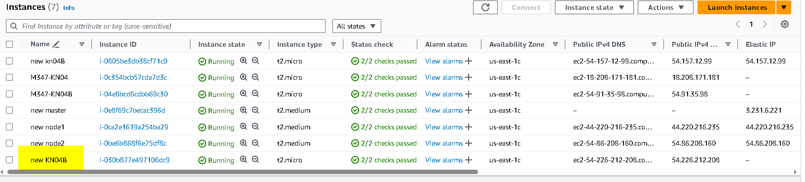

## KN04
## A
## a)
### Screenshot der Seite info.php. Scrollen Sie dabei zuerst runter bis die Felder REMOTE_ADDR
### und SERVER_ADDR sichtbar sind

### Screenshot der Seite db.php. Sie zeigen, dass beide Images im gleichen Netzwerk sind.

### Docker-Compose File (yaml-Datei)
### Dockerfile für Webserver
Siehe im KN04 Ordner

### Liste der Befehle, die docker compose up ausführt und deren Erklärungen

docker-compose pull: Lädt die neuesten Images für die Dienste herunter, die in der Docker-Compose-Datei definiert sind.

docker-compose build: Erstellt die Docker-Images basierend auf den Dockerfiles in der Docker-Compose-Datei.

docker-compose create: Erstellt Container für die Dienste, startet sie aber nicht.

docker-compose start: Startet die zuvor erstellten Container für die Dienste.

docker-compose up: Führt die Schritte von pull, build, create und start in einem einzigen Befehl aus, um die Docker-Compose-Umgebung zum Laufen zu bringen.

docker-compose attach: Hängt eine interaktive Shell an einen bereits laufenden Container an, um Befehle auszuführen und mit seiner Shell zu interagieren.

## b)
version: '3.8'

services:
  m347-kn04a-db:
    image: elmarkessler031/m347:kn02b-db
    container_name: m347-kn04a-db
    environment:
      MYSQL_ROOT_PASSWORD: password
      MYSQL_DATABASE: mysql
      MYSQL_USER: root
      MYSQL_PASSWORD: password
    networks:
      - m347-kn04a-net

  m347-kn04a-web:
    image: elmarkessler031/m347:kn02b-web
    container_name: m347-kn04a-web
    ports:
      - "80:80"
    networks:
      - m347-kn04a-net

networks:
  m347-kn04a-net:
    ipam:
      driver: default
      config:
        - subnet: 172.20.0.0/24
          gateway: 172.20.0.1
	  
### Screenshots der beiden Seiten

Erklärung:
Das Problem entsteht, weil die PHP-Anwendung versucht, eine Verbindung zur Datenbank herzustellen, aber die Domainauflösung fehlschlägt, möglicherweise aufgrund von DNS-Problemen oder einer falsch konfigurierten Verbindung. Um das Problem zu lösen, überprüfen Sie die DNS-Konfiguration des Servers und stellen Sie sicher, dass die Datenbankadresse korrekt ist. Außerdem sollten Sie sicherstellen, dass der Server eine aktive Internetverbindung hat und dass Firewalls oder Sicherheitsrichtlinien die Verbindung nicht blockieren.

## B
### Korrekte ausführung des Cloud-Inits

### Neu erstellte AWS Instanz mit Cloud_Init.yaml

Das cloud-init.yaml ist im KN04b Ordner.
### Info.php

### db.php

