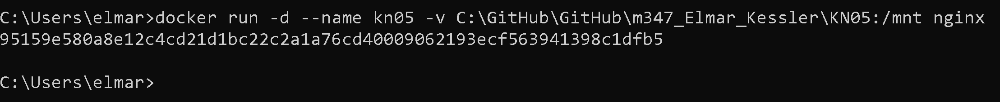
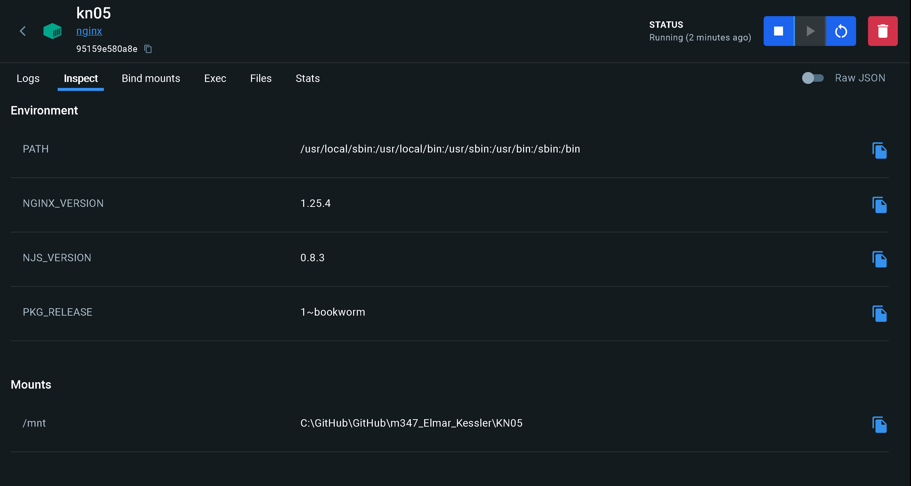
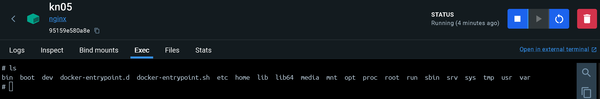
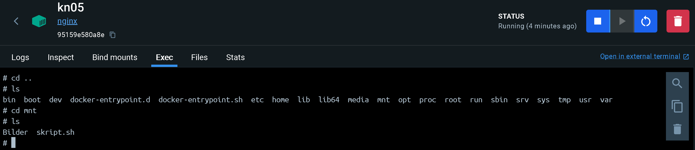
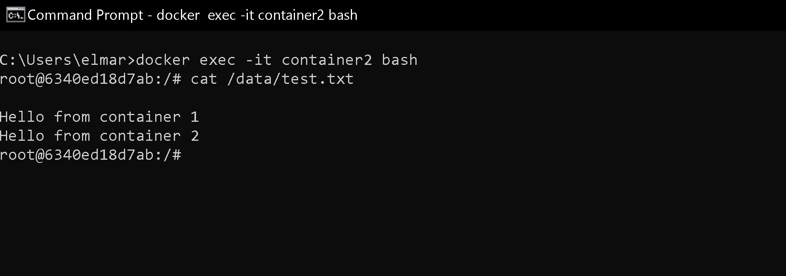
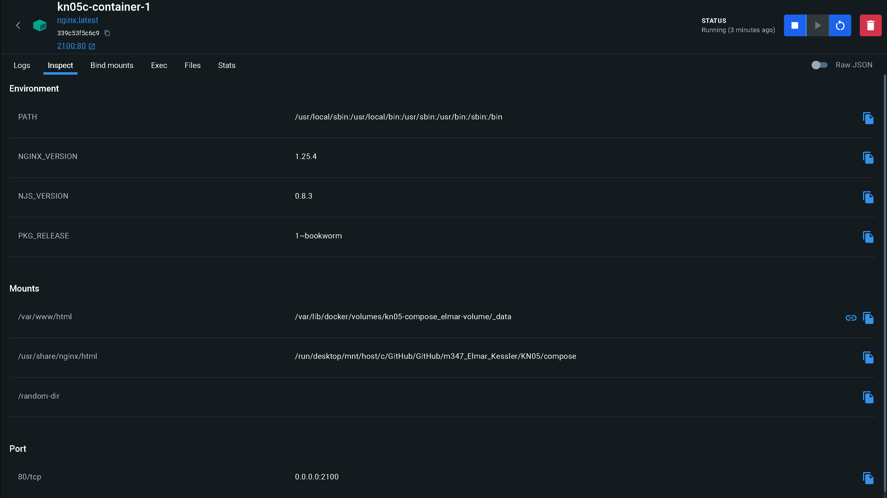
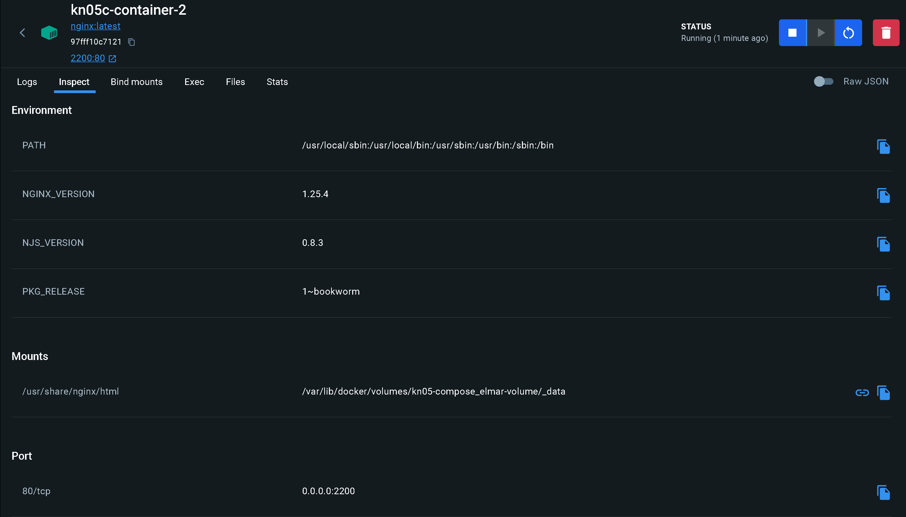

## KN05
## A 
### Befehle
### Container erstellen

Docker mit dem bind-mount erstellen: docker run -d --name kn05 -v C:\GitHub\GitHub\m347_Elmar_Kessler\KN05:/mnt nginx

Es ist noch kein File vorhanden

Es ist ein File vorhanden

Inhalt des File:
Schaue im skript.sh nach -> es ist ein basic Text output
## B
### Inhalt Volume

### Befehle
```
docker run -d --name container1 -v kn05Volume:/data nginx
docker run -d --name container2 -v kn05Volume:/data nginx

docker exec -it container1 bash
echo "Hello from container 1" >> /data/test.txt

docker exec -it container2 bash
echo "Hello from container 2" >> /data/test.txt
```
## C
### Compose Befehle

### Container 1 und 2



### Docker-Compose File (yaml-Datei)
Schaue bei /compose das kn05-compose.yaml an
