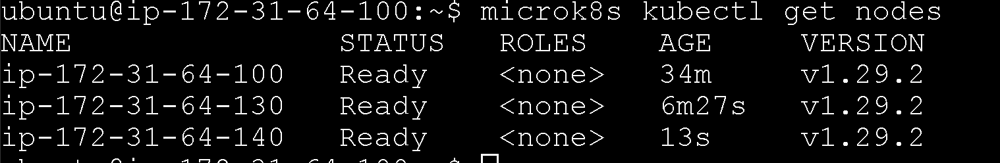
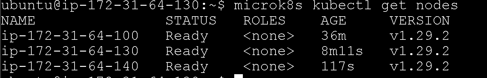
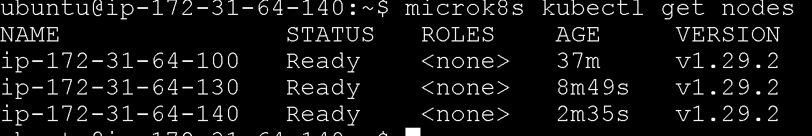
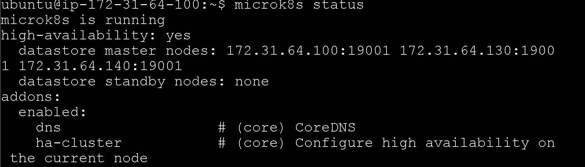
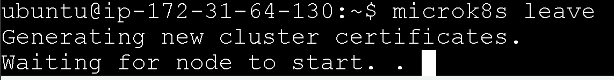
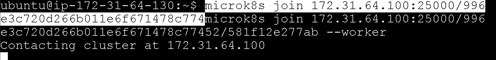
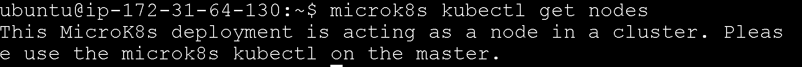
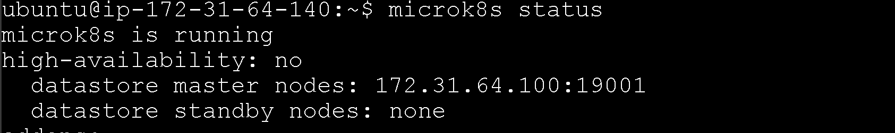

## A
### Master

### Node 1

### Node 2

## B
### Status

### Node entfernen
Ich entferne den Node mit microk8s leave

### Node 1 als Worker 
Hier erstelle mache ich einen Node als Worker (--worker)

### Node hinzufügen als Worker und microk8s status

### Befehl microk8s status (vor addons)

### Erkenntinis
```
Der wesentliche Unterschied besteht darin, dass ein High-Availability Cluster mehrere Nodes umfasst, die redundant sind, sodass im Falle eines Ausfalls eine andere Node die Arbeit übernehmen kann. Die IP-Adressen der verbundenen Nodes werden angezeigt, um den Status von Kubernetes zu beschreiben und zu zeigen, welche Nodes verbunden sind und welche Rolle sie einnehmen. Zusätzlich werden die hinzugefügten Add-ons angezeigt.

Mit MicroK8s kann man einzelne Nodes in einem Cluster verwalten, während man mit kubectl das gesamte Cluster bearbeitet, das aus mehreren Nodes besteht. Um das Cluster zu bearbeiten, muss man spezifisch "microk8s kubectl" verwenden.
```
